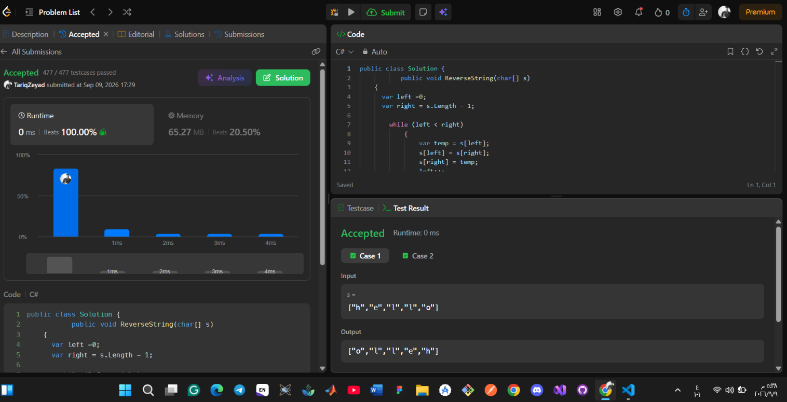

# LeetCode — Problem Solving

## Account

**LeetCode Profile:**
https://leetcode.com/u/SSDpmUOAyw/

**Problem:** Reverse String
https://leetcode.com/problems/reverse-string/

**Accepted Submission:**
https://leetcode.com/problems/reverse-string/submissions/2136439692/

---

## Problem

Solve **Reverse String** by modifying the input `char[]` in place.

The solution must use the **Two Pointers** approach and must not use built-in methods that reverse the array.

---

## Solution Approach

The solution uses two pointers:

* One pointer starts at the beginning of the array.
* The second pointer starts at the end of the array.
* The characters at both positions are swapped.
* Both pointers move toward the center.
* The process continues until the pointers meet.

This approach reverses the array **in place**, without creating another array.

---

## Complexity

| Complexity | Result   |
| ---------- | -------- |
| Time       | **O(n)** |
| Space      | **O(1)** |

The algorithm visits each element at most once, resulting in **O(n)** time complexity. Since the input array is modified directly and no additional array is created, the extra space complexity is **O(1)**.

---

## Accepted Submission

The following screenshot shows the **Accepted** LeetCode submission:

